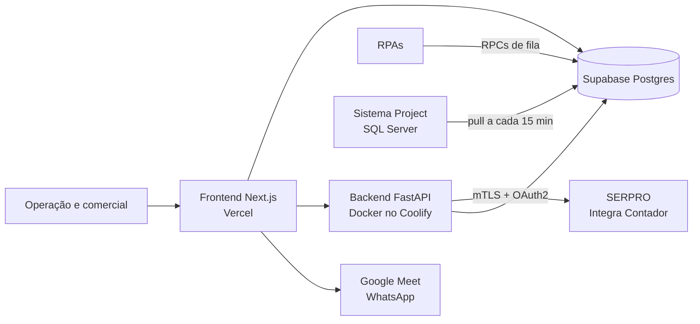
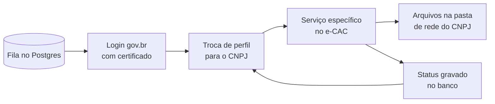

# Documentação dos Projetos — Automação & IA (Grupo Studio)

Sep 25, 2026 · @Victor Senisse

## Visão geral

A organização `Automacao-IA-Grupo-Studio` reúne 65 repositórios que automatizam a operação de uma consultoria tributária: consultas e downloads nos portais da Receita Federal, eSocial e SERPRO, processamento de arquivos SPED, cálculo de créditos e ferramentas comerciais. O centro é o AutomaTax, cuja fila e banco são consumidos pela maioria dos robôs.

| Projeto | Categoria | O que faz | Stack principal |
| --- | --- | --- | --- |
| automatax-back | Orquestração | Gateway SERPRO multicertificado, workers DCTFWeb/DARF e banco central da operação | FastAPI, Python, Supabase/Postgres, Docker |
| automatax-front | Orquestração | Painel de procurações, baixa de documentos, análise estratégica, reuniões e custos | Next.js 14, TypeScript, Supabase |
| Plataforma\_Checklist\_Automation | Orquestração | Interface local única para disparar os RPAs fiscais | FastAPI, Jinja2, HTMX, Playwright |
| aplogin | Infraestrutura | API que mantém e renova sessões autenticadas do e-CAC por certificado | Node.js/Express, Python, Playwright |
| aptcha | Infraestrutura | API de resolução de hCaptcha por fila assíncrona | Node.js, BullMQ, Redis, MySQL, Docker |
| SupplyTAX | SPED | Plataforma de ingestão e análise de SPED com ranking de fornecedores | Python, Polars, DuckDB, FastAPI, React |
| motor-sped | SPED | Motor de ingestão SPED de alta performance com catálogo de leiautes | Polars, DuckDB, Parquet, FastAPI, React |
| supply-tax | SPED | Simulador de impacto da Reforma Tributária multi-tenant | NestJS, Prisma, PostgreSQL, React |
| autoefd | Auditoria | App desktop de auditoria e recuperação de créditos (lineares, classificação, resultados) | Electron, React, Python, DuckDB |
| tax-lumen | eSocial | Processamento de XMLs do eSocial: cruzamento, empilhamento e apuração de créditos | FastAPI, React, DuckDB, PyArrow, PyInstaller |
| esocial-retificador | eSocial | Retificação de eventos periódicos do eSocial para recuperar créditos previdenciários | Next.js 16, Fastify, pg-boss, Supabase, Turborepo |
| hub-studio-law | Diagnóstico | Diagnóstico contábil a partir da ECF: Capag-E, balanço, DRE, DFC | NestJS, Prisma, SQL Server, React, FastAPI |
| diagnostics-law | Diagnóstico | Analisador SPED ECF e cálculo de Capag-E com exportação Excel | FastAPI, Pandas, HTML/JS |
| diagnostics-front-law | Diagnóstico | Painel do usuário para análise ECF por CNPJ | FastAPI, pymssql, HTML/JS |
| diagnostics-back-law | Diagnóstico | Processador da fila tributária a partir do SQL Server | Python, pymssql |
| plataforma-leidobem | Produto web | Gestão de P&D, dispêndios e dossiê MCTI para a Lei do Bem | Next.js 16, React 19, Supabase |
| TaxSwap | Produto web | Kits comerciais a partir de diagnóstico, Registrato e Situação Fiscal | Next.js 14, Supabase, Tesseract.js, React-PDF |
| supply-tax-lp | Comercial | Landing page com calculadora de impacto da Reforma | Next.js, Framer Motion, Resend |
| newtax-calc | Comercial | Simulador de preços, proposta e contrato do New Tax | HTML, CSS, JavaScript |
| newtax / newtax-crm | Comercial | CRM do New Tax com agenda e projetos | HTML/JS, Supabase REST |
| crm-chefes-de-receita | Comercial | Funil de vendas do Núcleo de Receitas | HTML/JS, Supabase, SheetJS |
| dashboard-lideres | Painéis | Painel de projetos e líderes | HTML, CSS |
| apresentacao\_rgm | Painéis | Painel regional de créditos e honorários a partir de Excel | Python, JavaScript, Vercel, Vercel Blob |
| -GS-\_DASHBOARD\_COMP | Painéis | Dashboard de compensações e restituições | Next.js, Google Sheets API, Drizzle |
| diagnostico\_enquadramento | Produto web | Laudo preliminar de enquadramento na Lei do Bem gerado por IA | Next.js, OpenAI API |
| portal-cliente | Produto web | Portal do cliente com carteira e envio de DARFs | Spring Boot, Java 17, React, S3, Docker |
| rpa\_dctf\_web\_checklist | RPA e-CAC | Baixa relatórios de débitos da DCTFWeb | Python, PyAutoGUI, OpenCV |
| executavel\_dctf\_web\_baixa | RPA e-CAC | Baixa assistida da DCTFWeb (executável) | Python, Playwright/CDP |
| rpa\_medias\_dctf\_web | RPA e-CAC | Apura médias previdenciárias da DCTFWeb por ano | Python, Selenium, pdfplumber |
| -GS-RPA\_MANUAL\_MEDIA\_DCTF\_FAT | RPA e-CAC | App com motores de médias DCTFWeb e faturamento | Flask, Playwright, pdfplumber |
| rpa\_dctfdec\_pdf | RPA e-CAC | Baixa DCTF em .dec e PDF | Python, PyAutoGUI, Playwright |
| exe\_dctf\_dec-pdf | RPA e-CAC | Painel executável para DCTF .dec + PDF | Python, CustomTkinter, Playwright |
| rpa\_darf\_checklist | RPA e-CAC | Extrai comprovantes de arrecadação (DARF) | Python, PyAutoGUI, OpenCV |
| -GS-\_RPA\_DARF\_MANUAL | RPA e-CAC | Emissão assistida de comprovantes DARF | Python, Playwright/CDP |
| rpa\_perdcomp\_checklist / exe\_perdcomp | RPA e-CAC | Baixa documentos PER/DCOMP 100% via DOM | Python, CustomTkinter, Playwright |
| exec\_perdcomp\_faltantes | RPA e-CAC | Descobre PER/DCOMP não baixados e pede cópias à Receita | Python, Selenium, PyAutoGUI |
| rpa\_perdcomp\_restituicao | RPA e-CAC | Cria e transmite pedidos de restituição PER/DCOMP | Python, FastAPI, Playwright |
| rpa-003-compensacao | RPA e-CAC | Prepara rascunhos de PER/DCOMP sem transmitir | FastAPI, React, Tailwind |
| rpa\_situacao\_fiscal | RPA e-CAC | Baixa relatórios de Situação Fiscal | Python, Playwright, CustomTkinter |
| rpa\_proc\_eletronica | RPA e-CAC | Extrai procurações eletrônicas recebidas | Python, PyAutoGUI, Playwright, Tesseract |
| rpa\_esocial\_baixa / executavel\_esocial\_baixa | RPA eSocial | Solicita e baixa arquivos do eSocial (produtor/consumidor) | Python, Playwright, PyAutoGUI |
| -GS-\_RPA\_EFDREINF\_AUTOMATICO / \_MANUAL | RPA EFD-Reinf | Baixa XMLs da EFD-Reinf e converte em XLSX | Python, Selenium/Playwright, FastAPI |
| -GS-\_RPA\_FATURAMENTO (+ \_MANUAL, \_ANALISE\_PERFIL\_E\_CONSOLIDADO\_BACKEND) | RPA faturamento | Calcula faturamento médio a partir de ECF e EFD-Contribuições | Python, psycopg, Flask |
| rpa\_faturamento\_project | RPA faturamento | Grava faturamento por CNPJ e ano para o sistema Project | Python, psycopg2 |
| rpa\_simples\_nacional | RPA faturamento | Consulta optantes do Simples e apura faturamento PGDAS-D | Python, Playwright, PyAutoGUI |
| `-GS-_RPA_CONSULTA_OPTANTES_-SIMPLES_NACIONAL-` | RPA faturamento | Consulta optantes do Simples em massa | Python, Playwright, pandas |
| receita\_bx\_api | RPA SPED | Baixa escriturações SPED pelo web service ReceitanetBX | Python, SOAP, psycopg2 |
| -GS-\_RPA\_PADRONIZACAO\_PASTA\_STUDIO-FISCAL | Utilitário | Cria a pasta padrão do cliente e organiza os SPEDs | Python, psycopg |
| -GS-\_RPA\_CARTAO\_CNPJ | RPA Receita | Emite o comprovante de CNPJ | Python, Playwright, PyAutoGUI |
| api-001-dctfweb | API SERPRO | Extrai DCTFWeb via Integra Contador e gera XLSX de perfil | Python, Pydantic, pdfplumber |
| api-002-consulta-darf | API SERPRO | Consulta pagamentos DARF e exporta CSV | Python, requests |
| serpro-caixa-postal | API SERPRO | Consulta a Caixa Postal (DTE) e avisos de pagamento | FastAPI, httpx, SQLite |
| conversor-dctfweb | Utilitário | Consolida PDFs DCTFWeb em XLSX offline | Python, pdfplumber, openpyxl |
| exe-conversor-layout-dctfweb | Utilitário | Converte Declaração Completa DCTFWeb para Relatório de Débitos | Python, pdfplumber, ReportLab |
| conversor\_dctfweb-darf | Utilitário | Exporta débitos DCTFWeb e DARF para TXT/XLSX | Python, CustomTkinter |
| script-instalador-certificados-na-maquina | Utilitário | Instala certificados A1 em lote no Windows | Python, certutil |
| Delphi | Legado | Fontes dos sistemas de auditoria e do Project em Delphi | Delphi/Pascal, FireDAC, UniGUI, SQL Server |
| TaxLumen-releases | Distribuição | Espelho privado de instaladores do Tax Lumen | GitHub Releases |
| management-hub | — | Repositório criado, ainda vazio | — |

## Orquestração e infraestrutura

### AutomaTax (automatax-back + automatax-front)

**Problema.** A consultoria acompanha centenas de CNPJs e, para cada um, precisa saber se há procuração ativa no e-CAC, qual o perfil previdenciário e de faturamento, e quais documentos baixar da Receita. Isso era feito com planilhas, consultas manuais e robôs sem coordenação.

**Como funciona.**

- **Verificação de procurações** individual e em lote pela API Integra Contador do SERPRO. Tenta vários certificados, usa cache e prioriza Ativa > Expirada > Cancelada.
- **Baixa de documentos**: o usuário abre solicitações de DCTFWeb, DARF, eSocial, PER/DCOMP, SPED (ReceitanetBX), Situação Fiscal e EFD-Reinf. Os robôs as consomem por RPCs de fila no Postgres (`dctfweb_get_fila`, `dctfweb_reservar`, `dctfweb_marcar_status` e equivalentes do eSocial).
- **Análise Estratégica**: classifica empresas em FastPass PRT/Fintax (faturamento ≥ R$ 200 mi) e FastPass Previdenciário (média mensal > R$ 500 mil) com os dados gravados pelos robôs. Empresas com média abaixo de R$ 40 mil saem da fila do eSocial.
- **Reuniões comerciais**: cria o evento no Google Calendar com link do Meet e envia o link por WhatsApp (Evolution API).
- **Custos SERPRO**: registra cada chamada paga e calcula o custo pela tarifação em faixas mensais (consulta, emissão e declaração).
- **Administração**: convites por e-mail, perfis admin / gestão / colaborador e permissão por automação.
- **Integração com o sistema Project** (SQL Server): um script PowerShell somente leitura puxa a agenda a cada 15 minutos e grava no Supabase de forma idempotente.

A web grava no banco, o backend fala com o SERPRO usando o certificado digital e os robôs leem e escrevem a mesma fila.

**Detalhes técnicos.**

- **Perfis SERPRO por variável de ambiente**: cada `SERPRO_KEY_{SUFIXO}` cria um perfil com certificado `.pfx` (arquivo ou base64), validado na subida.
- **Cache de token thread-safe** com lock por `consumer_key` e *double-checked locking*, com timeout no POST de autenticação para não travar o pool de threads do FastAPI.
- **115 migrations** versionadas, a maioria com rollback, aplicadas primeiro em homologação e depois em produção.
- **Padronização de nomenclatura** de 21 tabelas e 85 colunas com views de compatibilidade, para os consumidores antigos continuarem funcionando. O mapeamento de consumidores saiu do `pg_stat_statements`: 4.862 formas de consulta em 107 dias.
- Três tabelas mantêm o nome físico legado porque o Project as acessa por `ctid`, que não existe em views.
- Documentos de contrato de integração para o time dos robôs (`CONTRATO_RPA.md`) e para o Project (`CONTRATO_PROJECT.md`).

**Stack:** Next.js 14, TypeScript, Tailwind, SWR, Recharts, Supabase (Auth, Postgres, RLS), FastAPI, Python 3.12, requests-pkcs12, pdfplumber, Docker, Vercel, Coolify, Google APIs, Resend, Evolution API.

### Plataforma Checklist Automation

**Problema.** Cada RPA fiscal tinha seu próprio executável e sua interface, e o colaborador precisava alternar entre eles.

**Como funciona.** Plataforma web local (`127.0.0.1:8000`) que reúne os RPAs numa só interface. O colaborador faz login no e-CAC manualmente, e a plataforma executa o resto via Playwright conectado à porta de depuração do navegador. Cada RPA é uma subclasse de `BaseRPA` em `rpas/<slug>/`, descoberta automaticamente, e cada um tem o próprio repositório git versionado pela plataforma. Execuções rodam em paralelo por um orquestrador, e fila e status ficam no Postgres do AutomaTax.

**Stack:** FastAPI, Jinja2 + HTMX (sem build de frontend), Playwright síncrono, SQLAlchemy, PostgreSQL.

### aplogin — eCAC Session Manager

**Problema.** Cada robô precisava fazer login no e-CAC com certificado, o que é lento e dispara captchas.

**Como funciona.** Uma API Express mantém uma sessão por certificado (`sessions/<id>.json`). Scripts Python fazem o login por certificado no Chrome, extraem os cookies via CDP com Playwright e marcam a sessão como ativa. O `session_checker` verifica as sessões e o `session_renewer` renova as expiradas. Rotas autenticadas: listar sessões, obter a sessão ativa, verificar todas e forçar a renovação.

**Stack:** Node.js, Express, Python, Playwright, Chrome DevTools Protocol.

### Aptcha — API de captcha

**Problema.** Os portais da Receita usam hCaptcha, que interrompe os robôs.

**Como funciona.** `POST /api/captcha` enfileira um job (tipo, *sitekey*, URL da página) e devolve um `jobId`. Workers BullMQ resolvem o captcha pelo 2captcha, opcionalmente via proxy residencial, e o resultado é consultado por *polling*. Cada worker processa até 10 jobs simultâneos e escala com `docker compose --scale worker=N`. Há um dashboard de jobs, autenticação por `x-api-key` e validação opcional via `siteverify`. Os robôs de cartão CNPJ e PER/DCOMP consomem essa API.

**Stack:** Node.js 22, BullMQ, Redis 7, MySQL 8, Nginx, 2captcha, Docker Compose, PM2.

## Plataformas de SPED, eSocial e auditoria

### motor-sped

**Problema.** Arquivos SPED têm milhões de linhas, e cada família (EFD Contribuições, EFD ICMS/IPI, ECF, ECD) tem leiautes diferentes por versão. Aplicar o leiaute errado corrompe a análise.

**Como funciona.** O parser lê o início do arquivo, detecta a família pelos registros e pelo `0000`, extrai a versão declarada e resolve o catálogo só por família + versão. Sem catálogo detalhado, os campos caem em `col_1..col_n` em vez de usar outra versão. Os dados são gravados em Parquet (camada *silver*) e consultados com DuckDB. Uma CLI enfileira arquivos e processa com vários workers (`run --workers 4`), e um app web oferece importação, consultas (CFOP etc.), analytics, auditoria e gestão de projetos.

**Stack:** Python, Polars, DuckDB, PyArrow/Parquet, FastAPI, Loguru, psycopg, React + Vite, pytest.

### SupplyTAX

**Problema.** Para medir o impacto da Reforma Tributária nas compras, é preciso consolidar SPED e planilhas não fiscais de várias empresas e classificar fornecedores por regime tributário.

**Como funciona.** Evolução do motor-sped como plataforma multiempresa. Faz carga de SPED (EFD Contribuições, EFD ICMS/IPI, ECD) e de importações não fiscais em Excel, com validação, revalidação, estorno e exclusão de cargas. Gera o ranking de fornecedores (com regras de CFOP de entrada, chave de NF-e, CNPJ com zero à esquerda e fornecedores do exterior) e pesquisa o regime tributário, inclusive Simples Nacional por CSV. Tem motor de migrations por tenant, gestão de tarefas (grid e kanban), central de ajuda e trilha de auditoria de dados.

**Stack:** Python, Polars, DuckDB, PyArrow, FastAPI, psycopg, bcrypt, XlsxWriter, React + TypeScript, Docker Compose, Nginx, pytest.

### Supply Tax (simulador multi-tenant)

**Problema.** Clientes precisam simular cenários da Reforma Tributária (vendas, compras, tributos, transição, DRE projetado) com dados isolados por empresa.

**Como funciona.** Backend NestJS com um banco de controle (`control_db`) e um banco PostgreSQL próprio por empresa, provisionado automaticamente. O JWT identifica a empresa e roteia cada requisição ao banco tenant correto. O frontend tem wizard de criação de cenários (dados básicos, configuração tributária, empresas, regimes especiais) e uma central de análises com impactos, vendas/saídas, compras/entradas, tributos, transição, DRE projetado e revisão de contratos.

**Stack:** Node.js 20, NestJS, Prisma, PostgreSQL, React, Vite, Nginx, Docker Compose.

### autoEFD

**Problema.** A auditoria tributária era feita com cópia e cola entre planilhas gigantes, classificação manual de produtos e cálculo de créditos no Excel, em máquinas com pouco hardware.

**Como funciona.** App desktop *local-first* com três fluxos: **Lineares** (compara EFD/SPED com o declarado pela empresa), **Classificação** (confere a classificação fiscal dos itens pela TIPI e pela legislação) e **Resultados** (calcula os créditos não aproveitados). Cada análise tem o próprio banco DuckDB. O processamento é *out-of-core*, com leitura em partes, SQL e Parquet intermediário, e roda num worker Python separado do processo Electron.

**Stack:** Electron, React, Node.js, Python, DuckDB, python-calamine, pyxlsb, openpyxl, pytest.

### Tax Lumen

**Problema.** Recuperar créditos previdenciários exige cruzar milhões de eventos do eSocial (S-1010, S-1200, S-2299, S-5011) com a tabela de rubricas e as alíquotas.

**Como funciona.** Plataforma web que também roda como app desktop. O pipeline tem quatro etapas: **Conversor** (extrai XMLs de `.zip/.rar/.7z` e converte por evento para Parquet ou Excel), **Cruzamento** (S-1010 × S-1200/S-2299 com auditoria do S-5011, mais de 16 milhões de linhas via DuckDB), **Empilhamento** (consolida e enriquece com S-5011 e FPAS) e **Apuração** (calcula oportunidades com reflexos em outras entidades, patronal e RAT ajustado). Há também conferência de rubricas, base curada de pontos de crédito, editor da tabela FPAS, importação de PER/DCOMP com OCR, classificação de rubricas por IA (Anthropic, com confirmação humana), geração de apresentação e atualização automática por GitHub Releases. O progresso dos jobs chega em tempo real por WebSocket.

**Stack:** FastAPI, WebSocket, PyJWT, DuckDB, PyArrow, Polars, pandas, RapidOCR/ONNX, React 18, Vite, pywebview/WebView2, pystray, PyInstaller, Inno Setup.

### eSocial Retificador

**Problema.** Recuperar créditos previdenciários exige retificar eventos periódicos do eSocial, e a empresa dependia de uma ferramenta de terceiros (Govzilla).

**Como funciona.** Monorepo com `apps/web` (Next.js 16 na Vercel) e `apps/worker` (Fastify + pg-boss no Coolify). A web não chama o worker: grava o job numa fila pg-boss no Postgres, e o worker faz *polling*. Assim a `CERT_MASTER_KEY`, que decifra os certificados dos clientes, existe só no worker. O pacote `esocial-core` é domínio puro (parser, motor de teses, preflight), para a simulação usar exatamente o mesmo código que transmite. O `esocial-transport` concentra os limites do eSocial: 50 eventos por lote, 5 MB por mensagem SOAP, 10 consultas por dia por empregador e bloqueio do dia 1 ao 7. A comunicação é por mTLS e XMLDSig, com XSDs versionados e uma extensão de navegador de apoio.

**Stack:** TypeScript, Next.js 16, Fastify, pg-boss, Supabase/Postgres, pnpm, Turborepo, Docker, GitHub Actions.

### Hub Studio Law

**Problema.** Os diagnósticos contábeis e jurídicos (Capag-E, balanço, DRE, DFC, projeções, PLRA) eram montados à mão a partir da ECF.

**Como funciona.** Monorepo com três serviços: um worker Python/FastAPI que faz o parse do SPED ECF e aplica as regras de Capag-E, uma API NestJS + Prisma sobre SQL Server com autenticação, jobs e sincronização com *snapshots*, e um frontend React com tabelas contábeis hierárquicas, comparativos anuais e sandbox de testes.

**Stack:** Python, FastAPI, pandas, NestJS, Prisma, SQL Server, React, Vite, Docker Compose, Nginx, PM2.

### Diagnostics Law (diagnostics-law, diagnostics-front-law, diagnostics-back-law)

**Problema.** Calcular o Capag-E e extrair o balanço de cada cliente a partir da ECF, direto da pasta de rede do CNPJ.

**Como funciona.** O **diagnostics-law** é uma SPA com servidor FastAPI local. Ele lê a ECF em Latin-1, escolhe o período `A00` (anual) com *fallback* para `T04`, isola os registros `L100`/`L300` e o Lalur do bloco M, traduz a forma de tributação do registro `0010` e exporta um Excel formatado. O **front** é o painel do usuário, com upload e análise por CNPJ a partir dos jobs ativos no SQL Server. O **back** gera a fila tributária (job, cliente, franqueado, dias na etapa, produto) a partir do banco do Project e grava um JSON na rede.

**Stack:** Python, FastAPI, pandas, openpyxl, pymssql/pyodbc, HTML/CSS/JavaScript.

## Produtos web, comerciais e painéis

### Plataforma Lei do Bem (Studio Innova)

**Problema.** Empresas que usam o incentivo da Lei do Bem (Lei 11.196/2005) precisam provar ao MCTI e à Receita quanto gastaram em P&D: horas de pesquisadores, folha, notas fiscais e evidências por projeto. Esse controle vivia em planilhas.

**Como funciona.** Plataforma SaaS multiempresa:

- Projetos de P&D com trilha de maturidade TRL (níveis 1 a 7), equipe, pendências, documentos e acompanhamento.
- Diagnóstico com revisão por campo: o consultor comenta, aprova ou bloqueia cada etapa.
- Dispêndios (materiais, viagens, terceiros com justificativa técnica obrigatória), com leitura de nota fiscal em PDF.
- Motor financeiro: *timesheet* + folha importada consolidam a apuração mensal do incentivo.
- Emissão do dossiê MCTI em PDF, além de módulos de compliance DIRBI, obrigações, Lei de Informática e auditoria.
- Perfis ADMIN e CONSULTOR (acesso global), GERENTE\_PROJETOS (apuração e projetos da própria empresa) e RH (só folha).

O isolamento entre clientes usa o `empresa_id` em três camadas: Server Actions, RLS nas tabelas e políticas do Supabase Storage. A `service_role` só roda no servidor. Usuários novos recebem senha temporária e trocam no primeiro login. Scripts de verificação checam RLS, uploads e fluxos de aprovação.

**Stack:** Next.js 16, React 19, TypeScript, Tailwind 4, shadcn/ui, Supabase (Auth, Postgres, RLS, Storage), jsPDF, pdf-parse, xlsx, Recharts, Vercel.

### TaxSwap

**Problema.** Para cada proposta de recuperação de crédito, o comercial juntava à mão três documentos do cliente (diagnóstico tributário em XLSX, extrato Registrato do Banco Central e Situação Fiscal do e-CAC) e refazia as contas numa apresentação.

**Como funciona.** Wizard em 3 etapas (importação, revisão, diagnóstico final) que gera um PDF consolidado com a identidade visual da empresa.

- Extrai os PDFs com `pdfjs-dist` e cai para OCR (Tesseract.js) quando o PDF é só imagem. Páginas com confiança abaixo de 75% são reprocessadas com `sharp`.
- Calcula o crédito apresentável: base ADM (a parte FINTAX só indica risco), desconto por CAPAG (C = 40%, D = 60%), honorários (em geral 25%) e comparação com a dívida bancária (a vencer + vencidos).
- Valida o CNPJ pelo dígito verificador e completa os dados da empresa pela BrasilAPI.
- Valida uploads pelos *magic bytes* e rejeita PDF protegido por senha.
- Toda edição gera trilha de auditoria. Apresentações arquivadas viram *snapshots* imutáveis, e downloads usam *signed URLs* de um bucket privado.
- Testes com Vitest e gate `npm run verify` (lint + typecheck + testes + build) antes do deploy.

**Stack:** Next.js 14, React 18, TypeScript, Tailwind, Supabase (Postgres, magic link, Storage), @react-pdf/renderer, pdfjs-dist, Tesseract.js, zod, Vitest, Vercel.

### Supply Tax — landing page

**Problema.** O produto Supply Tax precisava de uma página de captação de leads B2B.

**Como funciona.** Landing page com calculadora interativa que estima a perda anual, mensal e diária de margem por faixa de faturamento (R$ 50 mi a + R$ 2 bi), setor e percentual de fornecedores do Simples, limitada a 90% do EBITDA. O formulário de diagnóstico envia o lead ao comercial por e-mail (Resend), com o diagnóstico em JSON anexo. Seções de herói, como funciona, linha do tempo da Reforma, prova social e FAQ.

**Stack:** Next.js, React, TypeScript, Framer Motion, Resend, Vercel.

### New Tax (newtax-calc, newtax, newtax-crm)

**Problema.** O time comercial precisava precificar os serviços de adequação à Reforma Tributária (ecossistema Supply Tax), gerar propostas e contratos, e acompanhar os clientes.

**Como funciona.** O **newtax-calc** é uma SPA que simula a precificação dinâmica, sinaliza clientes fora da faixa de atendimento, gera a proposta executiva e o contrato de prestação de serviços, com documentação da precificação e apresentação em slides. O **newtax** e o **newtax-crm** são o CRM do produto, com login, projetos, agenda e anexos, falando direto com a API REST, Auth e Storage do Supabase.

**Stack:** HTML, CSS, JavaScript puro, Supabase REST/Auth/Storage.

### CRM Chefes de Receita (Núcleo de Receitas)

**Problema.** Acompanhar o funil de vendas dos chefes de receita sem uma ferramenta de CRM.

**Como funciona.** SPA de arquivo único com funil de vendas por etapa, responsável, produto e origem; produção por vendedor; linha do tempo do dia; atividades por etapa; etiquetas e gestão de usuários. Os dados vêm de planilhas importadas (SheetJS) e do Supabase, com tema claro e escuro.

**Stack:** HTML, JavaScript, Supabase JS, SheetJS.

### Painel de Projetos & Líderes (dashboard-lideres)

Painel visual de arquivo único que mostra os projetos por líder e o status de cada um (ativo, em andamento, próximo, final, aguardando, V1, recorrente, em teste). **Stack:** HTML e CSS.

### Painel Regional (apresentacao\_rgm)

**Problema.** Consolidar as planilhas de performance de cada regional numa visão única.

**Como funciona.** O usuário faz login e envia uma planilha no modelo oficial (abas PERFORMANCE e BASE NEGOCIAÇÃO). Um extrator Python lê créditos e honorários apresentados, aprovados, em negociação e não aprovados, oportunidades por categoria e honorários mensais. O painel mostra matriz gerencial e percentual de aprovação. Roda local (porta 8765) ou na Vercel, com as planilhas no Vercel Blob.

**Stack:** Python, openpyxl, JavaScript, Vercel Functions, Vercel Blob.

### Dashboard de Compensações (-GS-\_DASHBOARD\_COMP)

Dashboard gerencial de compensações e restituições com abas, gráficos, filtros e tabelas. Lê uma planilha Google Sheets por conta de serviço, com *fallback* para um JSON estático, e exibe as regras de negócio no painel. **Stack:** Next.js, TypeScript, Google Sheets API, Drizzle, Python (extração).

### Diagnóstico de Enquadramento — Lei do Bem

**Problema.** Avaliar se os projetos de um cliente se enquadram como PD&I na Lei do Bem levava horas de redação técnica.

**Como funciona.** Um apresentador percorre um checklist guiado com o cliente, e o sistema redige um laudo técnico preliminar de enquadramento em PDF, com uma chamada à API da OpenAI por projeto. O laudo traz no rodapé que precisa ser validado por responsável técnico. A chave da API fica só no servidor e o acesso é protegido por senha compartilhada.

**Stack:** Next.js, TypeScript, OpenAI API (gpt-4o), geração de PDF, Vercel.

### Portal do Cliente

**Problema.** Os clientes precisavam receber os DARFs e acompanhar sua carteira sem depender de e-mail.

**Como funciona.** Frontend React servido por Nginx e backend Spring Boot com autenticação JWT, CRUD de clientes e responsáveis com controle de carteira, e envio de DARFs para o S3. As migrações são PostgreSQL. A produção roda em Docker Compose com HTTPS por Certbot e scripts de renovação.

**Stack:** Java 17, Spring Boot, Maven, PostgreSQL, React, TypeScript, Vite, Nginx, AWS S3, Docker.

## RPAs do e-CAC

Todos seguem o mesmo esqueleto: ler a fila, entrar no gov.br com certificado digital, trocar o perfil para o CNPJ do cliente (procuração) e então executar o serviço específico. Os mais novos usam Playwright via CDP sobre o Microsoft Edge nativo. Os mais antigos usam reconhecimento de imagem (PyAutoGUI + OpenCV).

Um login atende todos os CNPJs do mesmo certificado: o robô volta à home e troca apenas o perfil entre um cliente e outro.

### DCTFWeb

| Repositório | O que faz | Como funciona | Stack |
| --- | --- | --- | --- |
| rpa\_dctf\_web\_checklist | Baixa relatórios de débitos da DCTFWeb por CNPJ | Login automático por certificado e navegação por imagem; *screenshot* e retentativa em caso de erro | Python, PyAutoGUI, OpenCV, psycopg2 |
| executavel\_dctf\_web\_baixa | Versão assistida em executável | Operador faz um login por certificado; Playwright/CDP troca o perfil, filtra em blocos anuais (limite do portal), baixa cada apuração e pagina. Avisa com pop-up e som quando aparece o "Sou humano" | Python, Playwright, PyInstaller |
| rpa\_medias\_dctf\_web | Apura o saldo a pagar previdenciário ano a ano | Janela de 6 anos; nos 2 anos mais recentes baixa os PDFs e soma o saldo excluindo IRRF, PIS e COFINS; nos anteriores lê a tela. Grava a média anual em `valores_darf_prev` e sugere a data de reunião (+10 dias FastPass, +30 dias demais) | Python, Selenium, PyAutoGUI, pdfplumber |
| -GS-RPA\_MANUAL\_MEDIA\_DCTF\_FAT | App local com dois motores: médias DCTFWeb e faturamento | Origem fila/API devolve o resultado para a plataforma; origem manual só gera arquivos locais. Ano sem declaração entra como apuração zerada | Flask, Playwright, Selenium, pdfplumber, PyInstaller |

### DCTF (DEC + PDF)

| Repositório | O que faz | Como funciona | Stack |
| --- | --- | --- | --- |
| rpa\_dctfdec\_pdf | Baixa a DCTF em `.dec` e em PDF na mesma sessão | PyAutoGUI no login e no seletor de certificado nativo do Windows; depois Playwright via CDP na porta 9222 lê os `iframes`. `.dec` por varredura ano/mês no DECWEB; PDF por `Page.printToPDF`. Status 5 (sucesso), 6 (erro) e 12 (sem procuração) | Python, PyAutoGUI, Playwright, psycopg2 |
| exe\_dctf\_dec-pdf | Painel executável do mesmo fluxo | Arquivo único de cerca de 60 MB com `--atualizar` (baixa a versão nova do robô, \~84 KB), `--diagnostico` e `--calibrar` (fotografa o DOM da tela). Depois do login, não usa mouse nem teclado | Python, CustomTkinter, Playwright, PyInstaller |

### DARF

| Repositório | O que faz | Como funciona | Stack |
| --- | --- | --- | --- |
| rpa\_darf\_checklist | Extrai em massa os comprovantes de arrecadação | Filtro de 50 itens por página, detecção de fim de download, organização por CNPJ e retentativa em 3 camadas | Python, PyAutoGUI, OpenCV, Playwright |
| -GS-\_RPA\_DARF\_MANUAL | Emissão assistida de comprovantes DARF, DAS, DAE e DJE | Edge isolado via CDP (porta 9224); após o login manual, representa o cliente, filtra, emite e publica os PDFs na rede. Status 1 (aguardando), 7 (em execução), 5 (sucesso) e 6 (erro) | Python, Playwright, PyInstaller |

### PER/DCOMP

| Repositório | O que faz | Como funciona | Stack |
| --- | --- | --- | --- |
| rpa\_perdcomp\_checklist / exe\_perdcomp | Baixa documentos PER/DCOMP | Executável único com GUI que mostra a fila agrupada por certificado. 100% via DOM: sem reconhecimento de imagem e independente de resolução ou escala do Windows | Python, CustomTkinter, Playwright, psycopg2 |
| exec\_perdcomp\_faltantes | Descobre os PER/DCOMP nunca baixados e pede cópias à Receita | Login automático vencendo 2 captchas pelo Aptcha; exporta a listagem desde 2021, cruza com os PDFs da pasta pelo número de 24 dígitos e abre requerimentos de cópia em lotes de 12. `PERDCOMP_ENVIAR=0` percorre tudo sem enviar | Python, Selenium, PyAutoGUI, OpenCV |
| rpa\_perdcomp\_restituicao | Cria, confere e transmite pedidos de restituição | Lê a planilha, cria um rascunho por linha (Retenção) ou agrupa por período e documento (Pagamento Indevido, receita 1410), confere valores em centavos antes de salvar e, com confirmação explícita, envia e baixa o recibo. Checkpoints por etapa e licença offline assinada com Ed25519 | Python, FastAPI, Playwright, cryptography, PyInstaller |
| rpa-003-compensacao | Prepara PER/DCOMP de compensação e restituição em rascunho | Login manual; o robô preenche e para no rascunho, com a transmissão bloqueada. Frontend para escolher o serviço, preencher dados e acompanhar logs | FastAPI, Pydantic, React, TypeScript, Tailwind |

### Situação Fiscal e Procurações

| Repositório | O que faz | Como funciona | Stack |
| --- | --- | --- | --- |
| rpa\_situacao\_fiscal | Baixa o relatório de Situação Fiscal de cada CNPJ da fila | Edge com perfil temporário; após o login manual, Playwright/CDP seleciona o procurador, informa o CNPJ e baixa. Pausa quando surge captcha. GUI em MVC com cancelamento cooperativo | Python, Playwright, CustomTkinter, PyAutoGUI |
| rpa\_proc\_eletronica | Extrai as procurações eletrônicas recebidas por cada certificado | Loop contínuo das 00h às 08h. Login só por imagem, porque o gov.br detecta o CDP e dispara captcha; extração via Playwright em 4 fases (em análise, expirada, cancelada, ativa). O PDF da procuração é lido em cascata (PyMuPDF → pypdf → OCR Tesseract), e uma reconciliação faz *upsert* no Supabase | Python, PyAutoGUI, Playwright, PyMuPDF, pytesseract, Supabase |

## RPAs de eSocial e EFD-Reinf

### RPA eSocial (rpa\_esocial\_baixa e executavel\_esocial\_baixa)

**Problema.** Baixar o histórico de eventos do eSocial de cada cliente exige pedir um arquivo por mês e esperar o portal liberar, o que toma dias de trabalho manual.

**Como funciona.** Dois robôs independentes coordenados pelo Postgres no modelo produtor-consumidor:

- **`bot_solicitacoes`** (produtor) faz login com certificado e gera pedidos de arquivo para todos os meses de 2018 até hoje, agrupando por ano civil para contornar os timeouts do governo.
- **`bot_downloads`** (consumidor) respeita o timer obrigatório de 2 horas do eSocial, baixa, renomeia e organiza os arquivos na pasta de rede do CNPJ.

| Status | Significado |
| --- | --- |
| 1 | Aguardando solicitações |
| 2 | Criando solicitações |
| 3 | Aguardando downloads (lido após 2h30) |
| 4 | Efetuando downloads |
| 5 | Finalizado, com todos os arquivos da grade salvos |
| 13 / 14 | Erro nas solicitações / no download, com retentativa |
| 21 | Parcialmente completo, exige decisão manual |

Os códigos têm FK para a tabela de status, então um código inválido faz o UPDATE falhar. O **executavel\_esocial\_baixa** é a versão com interface para o operador e RPCs de fila (`esocial_get_fila`, `esocial_reservar`, `esocial_marcar_status`).

**Stack:** Python, Playwright, PyAutoGUI, OpenCV, pandas, psycopg2, Supabase, PyInstaller.

### EFD-Reinf automático (-GS-\_RPA\_EFDREINF\_AUTOMATICO)

**Problema.** Baixar os XMLs da EFD-Reinf de 5 anos para todos os CNPJs de cada certificado.

**Como funciona.** Abre o Chrome, faz a etapa visual de login com certificado, valida a porta CDP 9222 e anexa o Selenium à sessão autenticada. Percorre os CNPJs pendentes num período mensal móvel (do mês atual ao mesmo mês de 5 anos antes) e converte os XMLs em XLSX. Erros de CNPJ ou certificado ficam em *stand-by* para nova tentativa. Roda diário pelo Agendador de Tarefas do Windows, com filtro de certificados por `.env`.

**Stack:** Python, Selenium, requests-pkcs12, cryptography, xmltodict, pandas, psycopg.

### EFD-Reinf manual (-GS-\_RPA\_EFDREINF\_MANUAL)

**Problema.** Permitir que qualquer operador baixe a EFD-Reinf da própria máquina sem receber as credenciais do banco.

**Como funciona.** App desktop que processa CNPJs avulsos ou lotes por certificado, com Edge em modo anônimo e sessão isolada. Uma API servidora FastAPI faz a ponte com o banco, então nenhuma credencial sensível vai para o computador do operador. Os XMLs e planilhas são gerados localmente e publicados na rede, com log completo ao lado da aplicação.

**Stack:** Python, Playwright, FastAPI, Uvicorn, openpyxl, pandas, PyInstaller.

## RPAs de faturamento, Simples Nacional e SPED

### ReceitanetBX — download de SPED (receita\_bx\_api)

**Problema.** A baixa das escriturações SPED (ECF, PIS/COFINS, ECD e ICMS) era feita por automação de interface gráfica com PyAutoGUI e OCR, que quebrava com facilidade.

**Como funciona.** Usa o web service SOAP do ReceitanetBX Serviço, em três etapas: o Python solicita pela API, o serviço da Receita baixa em segundo plano gravando logs JSON, e o Python lê os logs, aplica as regras e move os arquivos para a rede. Na v2 é um processo residente: varre a fila a cada 5 minutos, baixa até 2 horas por certificado e retoma o que ficou parcialmente pendente. Inclui senhas criptografadas, gestão de espaço em disco, limpeza de versões superadas e tarefas agendadas por turno (madrugada, integral, ECD).

**Stack:** Python, SOAP/XML, requests, psycopg2, pycryptodome, PowerShell, Windows Task Scheduler.

### Faturamento por ECF (-GS-\_RPA\_FATURAMENTO e variantes)

**Problema.** Calcular o faturamento médio de cada CNPJ para classificar o perfil da empresa, a partir dos arquivos SPED já baixados.

**Como funciona.** Lê os arquivos `SPEDECF-*.txt` do ano atual e dos 5 anteriores, identifica a tributação pelo registro `0010` e soma as linhas de RECEITA BRUTA (ou equivalentes em `P200`/`Y750`). Quando um ano não tem ECF calculável, complementa pela EFD-Contribuições (PIS/COFINS), e no ano corrente usa sempre PIS/COFINS. O resultado é `FAT = total / anos usados`, gravado no perfil da empresa com relatório TXT por CNPJ. Também faz *recheck* de FastPass para perfis já faturados.

| Variante | Diferença |
| --- | --- |
| -GS-\_RPA\_FATURAMENTO | Versão de linha de comando integrada à fila do banco |
| -GS-\_RPA\_FATURAMENTO\_MANUAL | Interface web Flask local em executável; consulta a fila e devolve só o status pela API, sem acesso direto ao banco |
| -GS-\_RPA\_FATURAMENTO\_ANALISE\_PERFIL\_E\_CONSOLIDADO\_BACKEND | Worker contínuo como serviço do Windows; lê a fila direto no Postgres e gera, dos mesmos arquivos, a soma (consolidado) e a média (análise estratégica) |

**Stack:** Python, psycopg, Flask, pywin32, PyInstaller.

### Registro de faturamento anual (rpa\_faturamento\_project)

**Problema.** O sistema Project precisa do faturamento e do regime de cada cliente por ano.

**Como funciona.** Uma passada por execução, agendada a cada 10 minutos: lê a view `vw_faturamento_por_ano` e grava faturamento e código de regime (0 a 7) por CNPJ e ano. O regime é derivado do texto com um mapa que trata Simples Nacional, Arbitrado, acentos e variações, e a coluna da view serve de conferência, com aviso no log quando divergem. Usa *lock* por PID para não rodar em paralelo e tem testes unitários.

**Stack:** Python, psycopg2, pytest, PowerShell.

### Simples Nacional (rpa\_simples\_nacional e `-GS-_RPA_CONSULTA_OPTANTES_-SIMPLES_NACIONAL-`)

**Problema.** Para empresas que foram do Simples, o faturamento não está na ECF, e sim nas declarações PGDAS-D.

**Como funciona.** Em duas etapas. A **consulta de optantes** lê a fila, consulta no site da Receita se o CNPJ é ou foi optante, baixa o PDF e grava o período no Simples, sem certificado. O **faturamento PGDAS-D** entra no e-CAC com certificado e apura o faturamento de cada ano em que a empresa esteve no Simples. O site usa hCaptcha invisível, que só passa no Edge instalado de verdade (o Chromium do Playwright falha). Por isso o robô exige sessão gráfica ativa, 1920x1080 e DPI a 100%, com um fator de timeout ajustável para VMs lentas. O repositório de consulta de optantes é a versão isolada da etapa 1.

**Stack:** Python, Playwright (CDP no Edge), PyAutoGUI, OpenCV, pypdf, psycopg2, pandas.

### Cartão CNPJ (-GS-\_RPA\_CARTAO\_CNPJ)

Emite o comprovante de inscrição do CNPJ no site da Receita. Valida o CNPJ, preenche o formulário via Playwright, extrai a *sitekey* do hCaptcha, resolve o captcha pelo Aptcha com *polling* (a cada 5 s, até 120 s) e imprime o comprovante. Tem modo manual e ferramentas para calibrar coordenadas. **Stack:** Python, Playwright, PyAutoGUI, requests.

### Padronização de pastas (-GS-\_RPA\_PADRONIZACAO\_PASTA\_STUDIO-FISCAL)

Para cada empresa elegível (com job e faturamento), clona a estrutura modelo "00001 - PASTA PADRAO" na rede e move os SPEDs baixados para as subpastas certas: ECD e ECF em Contábil, EFD ICMS e EFD PIS em Fiscal. A elegibilidade vem de views no Postgres, e a data de criação fica registrada. Roda oculto por agendamento. **Stack:** Python, psycopg, SQL.

## Integrações diretas com a API SERPRO

Estes projetos usam a API Integra Contador do SERPRO em vez de navegar no e-CAC: sem captcha e sem tela, mas cada requisição é cobrada.

### api-001-dctfweb — extração de DCTFWeb

**Problema.** Obter as declarações DCTFWeb de vários CNPJs e classificar o perfil previdenciário sem abrir o portal.

**Como funciona.** Recebe a lista de CNPJs, calcula os meses do período e autentica por OAuth2 (Consumer Key + Secret, com renovação automática do Bearer Token). Baixa o PDF da declaração completa de cada mês, extrai código de receita, débitos, créditos, deduções e saldo, e gera um XLSX por CNPJ com três abas: Total, Previdenciário e Análise Perfil (média anual ÷ 13 meses). O arquivo recebe o sufixo `E_PERFIL` quando a média passa de R$ 50 mil por mês. CNPJs com erro são reportados por webhook. Há ambientes DEV e PROD, testes unitários e de integração.

**Stack:** Python, Pydantic, pydantic-settings, requests, pdfplumber, openpyxl, pytest.

### api-002-consulta-darf — pagamentos DARF

Consulta os pagamentos (DARF/DCTFWeb) de um CNPJ por período e exporta os campos financeiros para CSV separado por `;`. Tem modo Trial, com o token de demonstração do SERPRO, e modo Produção. **Stack:** Python, requests, python-dotenv.

### serpro-caixa-postal — Caixa Postal (DTE)

**Problema.** Acompanhar as mensagens da Caixa Postal da Receita de muitos CNPJs, principalmente os avisos de pagamento de PER/DCOMP.

**Como funciona.** App local que autentica com certificado A1 (`.pfx`) + Consumer Key/Secret. Permite consulta individual ou em massa (planilha ou lista colada, sem duplicados), com exportação em Excel ou CSV. Detecta mensagens "Aviso de Pagamento", consulta o detalhe e gera uma planilha formatada com data do crédito, valor e número do PER/DCOMP. Um dashboard de custos registra cada chamada em SQLite e calcula o gasto pela faixa de tarifação pós-paga do SERPRO, mês a mês e por serviço, certificado e dia.

**Stack:** FastAPI, Uvicorn, httpx, cryptography, openpyxl, SQLite, HTML/JS.

## Conversores, utilitários e legado

### Conversores de DCTFWeb e DARF

Três aplicativos Windows offline, que não consultam API nem internet, para transformar PDFs baixados do e-CAC em planilhas ou em outro layout.

| Repositório | Entrada → saída | Regras e detalhes | Stack |
| --- | --- | --- | --- |
| conversor-dctfweb | Pasta de PDFs DCTFWeb → XLSX consolidado (abas Total, Previdenciário e Análise Perfil) | Impede misturar CNPJs; recupera o período do cabeçalho em declarações antigas; média anual = soma previdenciária ÷ documentos mensais usados, sem contar o 13º; perfil quando a média de algum ano passa de R$ 40 mil. Interface ajustada a monitores de alta densidade e testes da regra | Python, pdfplumber, openpyxl, Pydantic, PyInstaller |
| exe-conversor-layout-dctfweb | Declaração Completa DCTFWeb → PDF no layout Relatório de Débitos | Valida estrutura, quantidade de blocos e identidade financeira; suporta períodos mensais e o 13º anual; agrupa débitos como no modelo oficial; erro isolado por arquivo; `--self-test` e build com checksum e manual do usuário | Python, pdfplumber, ReportLab, PyInstaller |
| conversor\_dctfweb-darf | PDFs de débitos DCTFWeb e comprovantes DARF → TXT (`;`) ou XLSX | Aba DCTF Web com filtro pelos 78 códigos da Revisão Previdenciária; aba DARF com 13 colunas; aba Viabilidade com média mensal por ano (÷ 13). Leitura em thread separada com barra de progresso; executável único de cerca de 33 MB | Python, pdfplumber, openpyxl, CustomTkinter, PyInstaller |

### Instalador de certificados (script-instalador-certificados-na-maquina)

Importa em lote certificados A1 (`.pfx`/`.p12`) para o repositório do usuário no Windows, sem pop-ups, lendo as senhas de um arquivo `nome_do_arquivo,senha`. Serve para preparar rapidamente as VMs que rodam os robôs. **Stack:** Python, `certutil`.

### Delphi (sistemas legados)

Repositório com os fontes dos sistemas desktop anteriores à automação atual, com cerca de 9.900 arquivos:

- **Project**, o sistema de gestão de jobs e clientes cujo banco SQL Server alimenta várias integrações atuais.
- **Audit** (versões 2.1 e 2.4, inclusive em PostgreSQL) e **AuditaCard**, sistemas de auditoria fiscal com cruzamentos configuráveis e pontos automáticos.
- Versões web em **UniGUI** (AuditaCardW, GestaoHesk), servidores **DataSnap**, uma **API** REST, importador de XML e o app **GS Pauta**.
- Scripts SQL de evolução do banco (tabelas de cruzamentos, usuários e validação do sistema) e o instalador do eAudit.

**Stack:** Delphi/Object Pascal, FireDAC, UniGUI, DataSnap, SQL Server, PostgreSQL.

### Repositórios de distribuição

- **TaxLumen-releases**: espelho privado dos instaladores e versões do Tax Lumen, consultado pelo próprio app para se atualizar.
- **management-hub**: repositório criado e ainda sem conteúdo.
